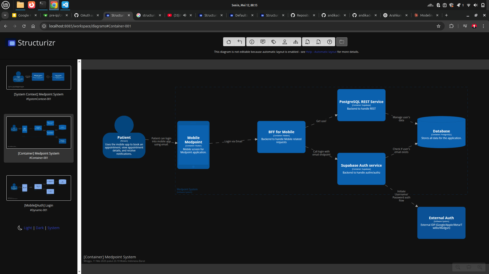

# 🛍️ Overview – Saucedemo E-Commerce Web

**Saucedemo** adalah situs web simulasi E-Commerce yang digunakan untuk melakukan pengujian antarmuka pengguna dan automasi testing. Situs ini menyediakan alur belanja lengkap, mulai dari login, melihat produk, menambahkan ke keranjang, hingga menyelesaikan transaksi (checkout). 

Website ini sangat cocok digunakan untuk memahami dan mendokumentasikan alur dasar sistem belanja online.

---

# 🧩 Structure & Content

Saat dilakukan dengan baik, proses dokumentasi fitur akan membantu Product Manager menemukan dan mendefinisikan:

- ✅ What (apa fiturnya?)
- ✅ Why (mengapa penting?)
- ✅ How (bagaimana cara kerjanya?)
- ✅ When (kapan digunakan?)
- ✅ Who (siapa yang menggunakan?)

---

## ❓ The Why – Problem Statement

### Apa yang ingin diselesaikan?

Pengguna memerlukan platform belanja online yang mudah digunakan dan aman. Tanpa sistem login dan checkout yang baik, proses transaksi menjadi membingungkan dan tidak dapat dipercaya.

### Tujuan Fitur:
- Memastikan pengguna hanya dapat mengakses sistem setelah login
- Memberikan pengalaman checkout yang jelas dan terstruktur

### Manfaat untuk Bisnis:
- Meningkatkan keamanan data pengguna
- Meningkatkan tingkat konversi transaksi
- Memberikan user experience yang baik bagi pengguna awam

---

## 🔄 The How – Cara Fitur Bekerja

### Login
- User memasukkan username & password
- Sistem memverifikasi ke server
- Jika berhasil, user diarahkan ke halaman produk
- Jika gagal, tampil alert "Username and password do not match"

### Checkout
- User menambahkan produk ke cart
- Klik cart icon → klik Checkout
- Isi form data pelanggan (nama, zip code)
- Konfirmasi transaksi dan tampil halaman sukses

---

## 📝 Scope of Work

### 🛠 Tools: Markdown

### Format Dokumentasi:
- ✅ Problem Statement
- ✅ How the Feature Will Work
- ✅ Functional Requirements
- ✅ UX/UI
- ✅ Business Logic

---

## ✅ Functional Requirements

### Login
- Form login harus menerima input username & password
- Validasi input tidak kosong
- Mengirim permintaan POST ke API login
- Menyimpan token/session jika berhasil
- Menampilkan pesan jika gagal login

### Checkout
- User dapat memilih produk dan menambah ke keranjang
- Keranjang dapat menampilkan item yang ditambahkan
- Form checkout harus memiliki field: First Name, Last Name, Zip Code
- Validasi field harus diisi sebelum melanjutkan
- Menampilkan halaman konfirmasi jika berhasil

---

## 🎨 UX/UI

### Login
- 2 Input field: username & password
- Tombol login
- Alert error jika login gagal

### Checkout
- Ikon keranjang
- Halaman ringkasan item
- Formulir data pembeli
- Tombol Continue dan Finish

---

## ⚙️ Business Logic

- **Login**
  - Jika kombinasi username/password benar → simpan session/token
  - Jika salah → tampil alert

- **Checkout**
  - Produk dapat ditambahkan ke cart
  - Data checkout divalidasi
  - Submit data menghasilkan halaman sukses
  - Jika ada field kosong → proses tidak dilanjutkan

---

## ✅ Validasi Penting

| Kategori               | Penjelasan                                                             |
|------------------------|------------------------------------------------------------------------|
| ✅ Status Code         | Cek status 200 saat login dan checkout berhasil                        |
| ✅ Response JSON       | Format JSON harus mengandung `token`, `bookingId`, dll                 |
| ✅ Tipe Data           | Contoh: price → number, firstname → string                             |
| ✅ Field Kosong        | Semua field harus divalidasi tidak kosong                              |
| ✅ Alur UI             | Tombol, alert, dan tampilan harus sesuai ekspektasi pengguna awam      |
| ✅ Path & Auth         | Pastikan endpoint dan otorisasi berfungsi dengan benar                 |

---

## 👤 Untuk Siapa Dokumentasi Ini?

Dokumentasi ini ditujukan agar:
- ✅ User awam dapat memahami proses bisnis dari login hingga transaksi selesai
- ✅ Developer dan QA bisa membuat test case berdasarkan flow yang jelas
- ✅ PM bisa menjelaskan fitur ke stakeholder non-teknis dengan mudah

---

## 🧾 Catatan Tambahan

📸 Untuk memperjelas, tambahkan screenshot dari setiap halaman: 
- Halaman Login

- Inventory (produk)
- Cart
- Checkout
- Order Confirmation

🎥 (Opsional) Buat walkthrough video berdurasi 3–5 menit menjelaskan alur login sampai checkout.
