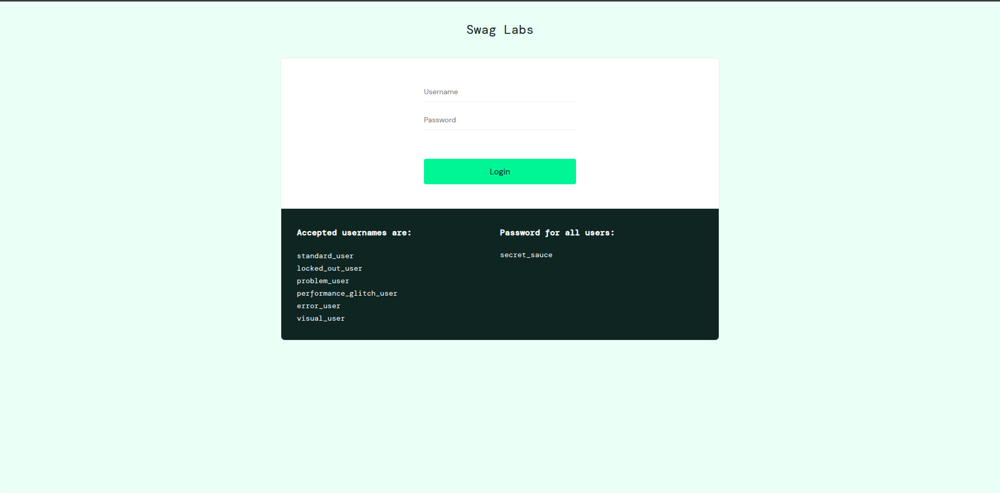
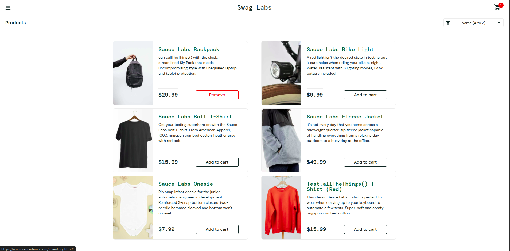
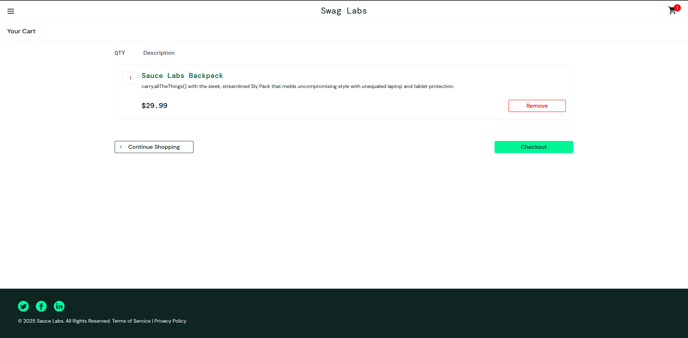
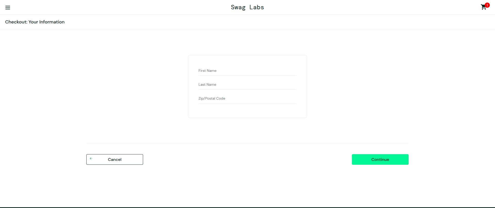
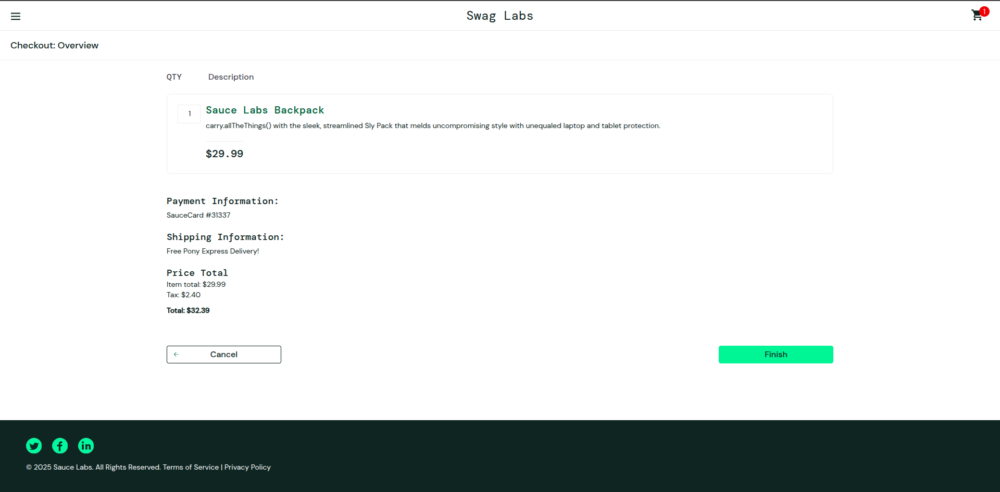
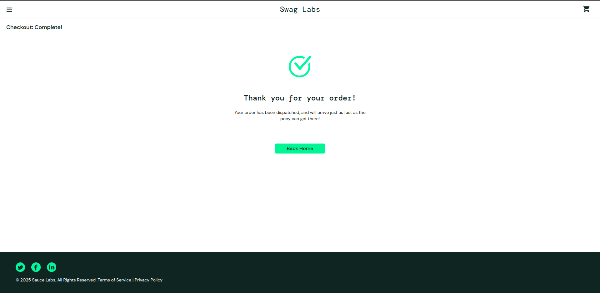

# 🛍️ Overview – Saucedemo E-Commerce Web

**Saucedemo** adalah situs web simulasi E-Commerce yang digunakan untuk melakukan pengujian antarmuka pengguna dan automasi testing. Situs ini menyediakan alur belanja lengkap, mulai dari login, melihat produk, menambahkan ke keranjang, hingga menyelesaikan transaksi (checkout). 

---

# 🧩 Structure & Content

## ❓ The Why – Problem Statement
## Login

Pengguna perlu mengakses akun pribadi mereka agar dapat melihat riwayat pesanan, menyimpan produk ke keranjang, dan menyelesaikan transaksi dengan aman. Tanpa login, sistem tidak dapat mengidentifikasi pengguna dan data pengguna tidak bisa disimpan secara personal.

## Chechkout
Pengguna yang telah memilih produk perlu menyelesaikan proses pembelian dengan memberikan data pengiriman dan melakukan konfirmasi. Tanpa fitur checkout, transaksi tidak bisa dicatat dan pengiriman tidak dapat dilakukan.

### Tujuan Fitur Login & Checkout:
- Memastikan pengguna hanya dapat mengakses sistem setelah login
- Memberikan pengalaman checkout yang jelas dan terstruktur

--- 

## 🔄 The How – Cara Fitur Bekerja

### Login
- User memasukkan username & password
- Sistem memverifikasi ke server
- Jika berhasil, user diarahkan ke halaman produk
- Jika gagal, tampil alert "Epic sadface: Username and password do not match any user in this service"

### Checkout
- User menambahkan produk ke cart
- Klik cart icon → klik Checkout
- Isi form data pelanggan (First Name , Last Name , Zip/Postal Code)
- Konfirmasi transaksi dan tampil halaman sukses

---

## 📝 Scope of Work

### 🛠 Tools: Markdown

## ✅ Functional Requirements

### Login
- Form login harus menerima input username & password
- Validasi input tidak boleh kosong
- Menampilkan pesan jika gagal login

### Checkout
- User dapat memilih produk dan menambah ke keranjang
- Keranjang dapat menampilkan item yang ditambahkan
- Form checkout harus memiliki field: First Name, Last Name, Zip Code
- Validasi field harus diisi sebelum melanjutkan
- Menampilkan halaman konfirmasi jika berhasil

---

## 🎨 UX/UI Dokumentasi

### Login
- 2 Input field: username & password
- Tombol login
- Alert error jika login gagal

### UI Login Page

### Checkout
- Ikon keranjang
- Halaman ringkasan item
- Formulir data pembeli
- Tombol Continue dan Finish

### UI Chart Page

### UI Validate Page

### UI Fill Page

### UI Confirmation Page

### UI Checkout Page

---

## ⚙️ Business Logic

- **Login**
  - Jika kombinasi username/password benar → Redirect ke chart page
  - Jika salah → tampil alert "Epic sadface: Username and password do not match any user in this service"

- **Checkout**
  - Produk dapat ditambahkan ke cart
  - Data checkout divalidasi
  - Submit data menghasilkan halaman sukses
  - Jika ada field kosong → proses tidak dilanjutkan

---

## ✅ Validasi
 
1. Inputan Username dan Password harus sesuai.
2. Jenis Inputan pada verifikasi Data harus sesuai.
3. Semua kolom isian tidak boleh dibiarkan kosong saat pengguna mengisi formulir.
4. Tampilan aplikasi harus jelas, tombol bisa ditekan dengan mudah, dan pesan muncul di saat yang tepat.

---

## Run Preview 
ctrl + shift + v 

